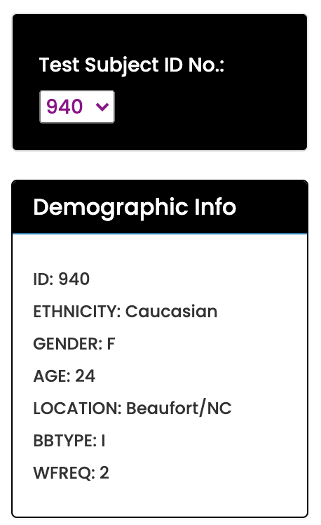
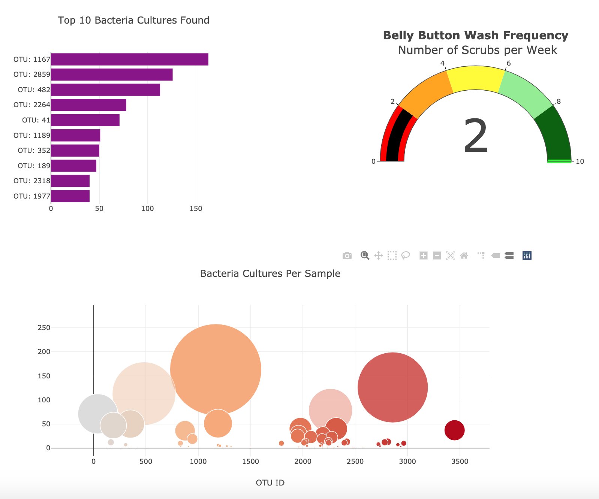
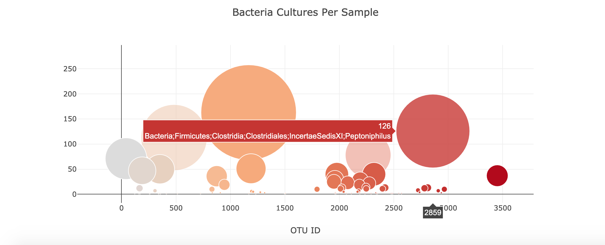

# Belly Button Biodiversity
Building an interactive webpage with data visualization using JavaScript and Poltly.

## Overview
Scientists from Improbable Beef(TM) are investigating bacteria from the human belly button to find the types that synthesize proteins that mimic the taste of real meat. To visualize the data, we built an interactive webpage so that volunteers can view the results of thier belly button analyses. If they contain the right composition of bacteria, they may be able to sell their samples to ImprobableBeef(TM) for use in their meat subsitute recipe.

## Webpage Use

[Belly Button Biodiversity Webpage](https://jayjohnson526.github.io/)

Use the drop down menu on the left to select the volunteer ID.  

The results for the top ten bacterial cultures that were detected, a bubble chart displaying the frequency of each bacteria type, and the belly button wash frequency will automatically load. 

Hover over each value in the bar and bubble charts to view the name of each bacteria species.

